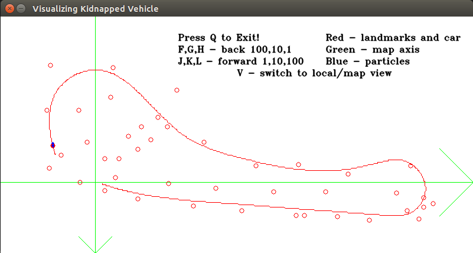
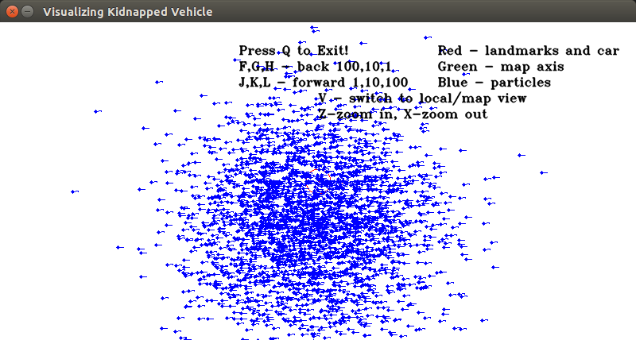

# Visualization-Kidnapped-Vehicle-Project
Vizualization for CarND-Kidnapped-Vehicle-Project
https://github.com/udacity/CarND-Kidnapped-Vehicle-Project

Requires OpenCV if compilation is done from source.

# How to use it
Download executable VisualizeParticleFilter from https://github.com/Valtgun/Visualization-Kidnapped-Vehicle-Project
Save the file in the /CarND-Kidnapped-Vehicle-Project folder
It should contain child directory data and out (see below)
Run executable ./VisualizeParticleFilter

See on screen instructions

# How to save particle info to out folder
In the Visualization-Kidnapped-Vehicle-Project:

Create folder "out"

In the file: Main.cpp add the following:
Find the following lines and add after loop:
// simulate the addition of noise to noiseless observation data.
for (int j = 0; j < observations.size(); ++j) {
  ...
}
// after the above lines

std::ostringstream filename;
filename << "out/out_particles_" << setfill('0') << setw(6) << i+1 << "_pred.txt";
pf.write(filename.str());

// before line below
pf.updateWeights(sensor_range, sigma_landmark, noisy_observations, map);

/_
# Sample screenshots
Map of landmarks:

Zoomed in view of particles around location:

